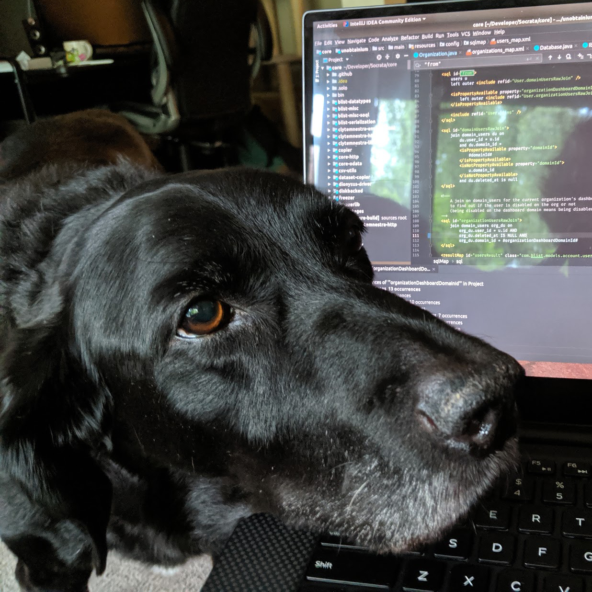

# [✨ gooddogs.direct ✨](https://gooddogs.direct)

Good Dogs Direct aggregates good dogs in your area from PetFinder and Adopt-A-Pet and
displays them in chronological order, starting with the most recently
added dogs.

I built this site after my dog [Phil](#dedicated-to-phil) passed away and we were looking to adopt a new dog. Days of looking a Petfinder and Adopt-a-pet made me wanting something a little more fun and colorful with pertinent information displayed more clearly (distance, good with cats/dogs/kids, etc.)

## Project layout 🕵️‍♀️

### `src` / `public`

This is a [create-react-app](https://github.com/facebook/create-react-app) project.

It uses [👩‍🎤 Emotion](https://emotion.sh/docs/introduction) for styles.

### `netlify/functions`

This contains serverless functions that run on [Netlify](https://www.netlify.com/).

When these are built, they are built into the `lambda` directory. This directory is _not_ checked into Git and is built when the app is deployed to Netlify.

It's worth noting that the `netlify/functions/util` directory does NOT get included in the production build. It is part of the bundled `.js` files that are built with [the `build-functions`](#npm-run-build-functions) command.

#### [`netlify/functions/dogs.ts`](./netlify/functions/dogs.ts)

This is currently the only function. It will take the given query parameters for the user's location and some search settings and then it will return dogs from both Petfinder and Adopt-a-pet. It does this with a lot of mapping and filtering and even some HTML parsing 😯

## Scripts 📜

### Running the project locally

The best way to run the project is via the [Netlify CLI](https://docs.netlify.com/cli/get-started/#run-a-local-development-environment)

In short...

- `npm install` at the root of this project
- `npm install -g netlify-cli`
- Set the necessary [environment variables](#environment-variables)
- `netlify dev`

This will build and host the lambda functions and start the `create-react-app` dev server.

### `npm start` / `npm run build` / `npm run test`

These all call out to `react-scripts` (`create-react-app`) ro run/build/test the React app.

### `npm run build-functions`

This uses [`netlify-lambda`](https://github.com/netlify/netlify-lambda) to build the functions in `netflify/functions` from TypeScript into a bundle. This all goes through Babel using the root [`.babelrc`](./.babelrc) file.

### [`netlify.toml`](./netlify.toml)

Pretty simple stuff.

Under `build`, the `command` will build the `create-react-app` app and the functions.

The site is served from `site` and the functions are served from `lambda`. Neither of these are checked in and are built and deployed by Netlify automatically.

## Environment Variables 🔐

Environment variables can be set via a `.env` file.

It should look like:

```
PETFINDER_API_KEY=[YOUR API KEY]
PETFINDER_API_KEY_SECRET=[YOUR API SECRET]
```

This file is ignored by Git.

### `PETFINDER_API_KEY` / `PETFINDER_API_KEY_SECRET`

These are needed to hit the [Petfinder API](https://www.petfinder.com/developers/v2/docs/) to get dogs.

API keys can be generated by signing up for a Petfinder account and going to your [developer settings](https://www.petfinder.com/user/developer-settings/).

## Weird Bits 👽

There were quite a few hoops to jump through to to get all of this to work. These are documented below.

### Getting the full description from Petfinder

By default, Petfinder's API will only return a partial description for each animal and it would always cut it off in a weird spot.

In Petfinder's own words:

> The limit is actually 20 words, but this is as-designed at this time, to send people to Petfinder for more information about the pet.

I wanted to get a little bit more description so I ended up taking the brute force approach and using [cheerio](https://cheerio.js.org/) to fetch and parse the _entire Petfinder page_ for the pet and then grab the description from there. It's slow but it works!

You can see this being done in [netlify\functions\util\PetFinder\api.ts](./netlify\functions\util\PetFinder\api.ts)

### Reverse engineering Adopt-a-Pet's GraphQL API

This was classic reverse engineering; inspecting network calls being made in the browser, seeing that they are GraphQL, and then using GraphQL queries to find out what kind of info you can get out of the API.

Lucky for us, the API is left completely open and unauthenticated! Yay! Double lucky for us, GraphQL has advanced ways to inspect what the API can return!

For example, if you wanted to see all of the different fields that Adopt-a-pet has about pets, you can use the following query `POST`ed to `https://hasura.adoptapet.com/v1/graphql`:

```graphql
{
  __type(name: "pet_catalog_search_pets_geo_return_type") {
    name
    fields {
      name
      type {
        name
        kind
        ofType {
          name
          kind
        }
      }
    }
  }
}
```

You can see the query that ended up being used in [netlify\functions\util\AdoptAPet\api.ts](./netlify\functions\util\AdoptAPet\api.ts).

### Reverse Geocoding

One of the goals I had was to use the browser's [Location API](https://developer.mozilla.org/en-US/docs/Web/API/Location) to get the user's location.

This only gives you latitude/longitude, but both Petfinder and Adopt-a-pet expect something like a ZIP code or a City, State combo.

After spending _way too long_ trying to figure out how to use some government-hosted APIs to do this, I finally found [OpenStreetMap Nominatim](https://nominatim.org/).

_THANK YOU_ OpenSreetMap. This app should be used infrequently enough to comply with [the usage policy](https://operations.osmfoundation.org/policies/nominatim/). If it doesn't let me know!

## Special Thanks 🙏

- [The Noun Project](https://thenounproject.com/) for all of the icons
- [PetFinder](https://www.petfinder.com/) for having a free, easy-to-use API
- [Adopt-a-pet](https://www.adoptapet.com/) for having a GraphQL API that was easy to reverse engineer
- [OpenStreetMap Nominatim](https://nominatim.org/) for an actually usable reverse geocoding API

## Dedicated to Phil 🐕

[✨ gooddogs.direct ✨](https://gooddogs.direct) is dedicated to the sweetest boy, Phil. I miss you buddy.

<p align="center">
    
</p>
<p align="center">
  <em>2004 - 2019</em>
</p>
